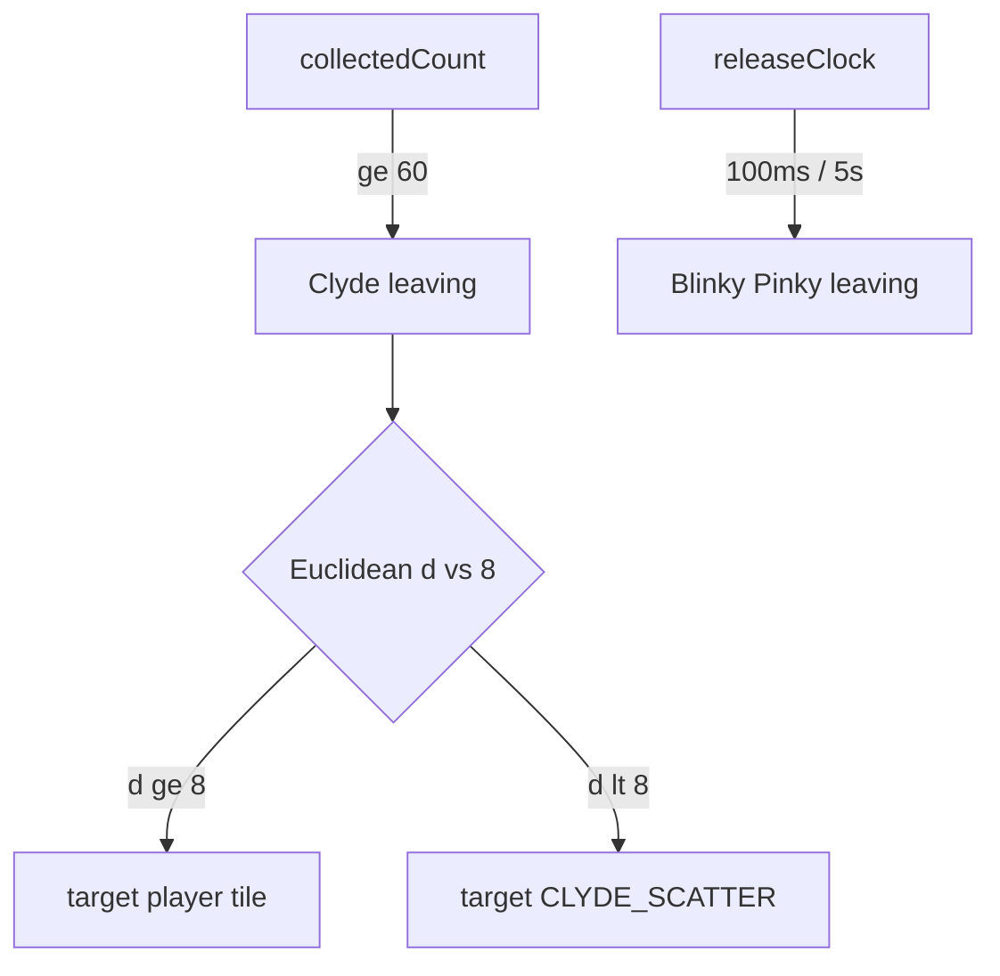

# Add Clyde (pellet leave + shy chase)

## Goal

Ship Clyde as a third ghost: stacked mid-house spawn, leave when **`collectedCount >= 60`** (tunable), chase with dossier shy logic (Euclidean tile distance **`< 8`** → SW scatter target, else player tile), scatter to tunable SW corner default `(0, 33)`. Keep Blinky/Pinky time releases and Cruise Elroy exactly as today. No Inky, no Clyde-gated Elroy, no fright.

## Locked decisions

| ID  | Decision                                                                                                                                                          | Source  |
| --- | ----------------------------------------------------------------------------------------------------------------------------------------------------------------- | ------- |
| 1b  | Clyde leave = arcade-style **pellet count** only: `CLYDE_RELEASE_PELLETS = 60` (level-1 dossier). No full personal/global counter framework; no inactivity timer. | user    |
| 2   | N/A — no time-delay default for Clyde.                                                                                                                            | user    |
| 3   | Keep Euclidean distance; **`≥ 8` chase Pac-Man**, **`< 8` target scatter corner**. Constant `CLYDE_SHY_TILES = 8`.                                                | user    |
| 4   | Stacked spawn: same `ghostHouseSpawnCenter()` as Blinky/Pinky.                                                                                                    | user    |
| 5   | Do **not** implement Clyde-gated Elroy; Cruise Elroy stays Blinky-only as today.                                                                                  | user    |
| A   | `GHOST_KIND.clyde` + `clydeTarget` + explicit `ghostAi` branch (no Blinky fallthrough).                                                                           | default |
| B   | `CLYDE_SCATTER_COL/ROW = 0, 33` (tunable SW unreachable).                                                                                                         | default |
| C–G | Exit tile / stationary / no bias; non-Blinky speed; `clyde.png` + `spawnClyde`; reuse catch/reverse/mode start-once; no fright.                                   | default |
| H–K | Docs ARCHITECTURE + README; tests; `verify` + live 5174; `/simplify-pr` then `/no-comments`.                                                                      | default |
| L–M | Out of scope + catch→menu for Clyde same as other ghosts.                                                                                                         | default |

## Today’s world (brief)

- Kinds: Blinky/Pinky only ([`src/domain/ghostKind.ts`](src/domain/ghostKind.ts)).
- Release: shared clock + per-kind **ms** delays ([`src/domain/ghostRelease.ts`](src/domain/ghostRelease.ts) / [`src/game/systems/ghostRelease.ts`](src/game/systems/ghostRelease.ts)).
- AI: pinky vs blinky only ([`src/game/systems/ghostAi.ts`](src/game/systems/ghostAi.ts)) — unknown kinds incorrectly get Blinky targeting.
- Pellets: [`pelletProgress.collectedCount`](src/domain/pelletProgress.ts) already available in PlayScene.
- Art: [`public/art/ghosts/clyde.png`](public/art/ghosts/clyde.png) unused.

## Approach

### 1. Domain: kind + Clyde target + pellet leave

- [`src/domain/ghostKind.ts`](src/domain/ghostKind.ts): add `clyde: 2`.
- [`src/domain/ghostTarget.ts`](src/domain/ghostTarget.ts):
  - `CLYDE_SCATTER_COL = 0`, `CLYDE_SCATTER_ROW = 33`, `CLYDE_SHY_TILES = 8`.
  - `clydeTarget({ phase, mode, playerCol, playerRow, ghostCol, ghostRow })`:
    - `leaving` → house exit tile.
    - `scatter` mode → Clyde scatter constants.
    - `chase`: `hypot(ghostCol - playerCol, ghostRow - playerRow)`; if `< CLYDE_SHY_TILES` → scatter corner; else player tile.
- [`src/domain/ghostRelease.ts`](src/domain/ghostRelease.ts):
  - Add `CLYDE_RELEASE_PELLETS = 60`.
  - Add `shouldReleaseKind(kind, clock, collectedCount)`: Clyde → `collectedCount >= CLYDE_RELEASE_PELLETS`; Blinky/Pinky → existing time delays. Do **not** map Clyde through `releaseDelayForKind` (would wrongly use Blinky’s 100ms via default).

### 2. Systems + scene

- [`src/game/systems/ghostRelease.ts`](src/game/systems/ghostRelease.ts): signature `ghostRelease(world, clock, collectedCount)`; use `shouldReleaseKind`.
- [`src/game/scenes/PlayScene.ts`](src/game/scenes/PlayScene.ts): pass `this.pelletProgress.collectedCount`.
- [`src/game/systems/ghostAi.ts`](src/game/systems/ghostAi.ts): branch `clyde` → `clydeTarget` with ghost tile; keep pinky/blinky; never fall through Clyde to Blinky.
- [`src/domain/playfield.ts`](src/domain/playfield.ts) + [`src/game/systems/render.ts`](src/game/systems/render.ts): `CLYDE_DRAWABLE_ID`, preload/draw `clyde.png`.
- [`src/game/scenes/PlayScene.ts`](src/game/scenes/PlayScene.ts): `spawnClyde()` via existing `spawnGhost` (stacked center).

### 3. Speed / Elroy / mode

- No Elroy changes (`resolveGhostSpeedForKind` already non-Blinky = base+tunnel).
- Mode clock start-once unchanged.

### 4. Docs

Update [`docs/ARCHITECTURE.md`](docs/ARCHITECTURE.md) + [`README.md`](README.md) Status: three ghosts; Clyde pellet leave + shy chase + SW scatter.

## Data / contracts

- `GHOST_KIND.clyde`, `CLYDE_RELEASE_PELLETS`, `CLYDE_SHY_TILES`, `CLYDE_SCATTER_*`, `clydeTarget` args including ghost tile.
- `ghostRelease(world, clock, collectedCount)`.
- No persistence / feature flags.

## Failure behavior

- Clyde `leaving`/`active` circle-overlap → siren stop → `MenuScene` (existing `catchPlayer`).
- Clyde stays in house until 60 pellets; if player never reaches 60, Clyde never leaves (arcade-faithful for counters-only; inactivity timer out of scope).

## Docs

- [`docs/ARCHITECTURE.md`](docs/ARCHITECTURE.md) — kind list, Clyde release/target, pipeline note for `collectedCount` into release.
- [`README.md`](README.md) — Status: Blinky + Pinky + Clyde.

## Acceptance tests

- Unit: `clydeTarget` leaving; scatter mode; chase `d >= 8` → player; chase `d < 8` → scatter; boundary `d === 8` → player.
- Unit: Clyde releases at `collectedCount >= 60`, not before; Blinky/Pinky still time-based.
- System: three-kind release (Blinky@100ms, Pinky@5s, Clyde@60 pellets); Clyde speed ignores Elroy.
- Catch: active Clyde overlap still true (existing tests + kind spawn if needed).
- `npm run verify` green.
- Live **5174**: Clyde visible in house; after ~60 dots leaves; near Pac-Man retreats toward SW; far away chases; contact → menu.

## Out of scope

Inky; full Pinky/Inky personal + global counters; inactivity force-exit; Clyde-gated Elroy; fright/eyes; red zones; door art; bounce; exit bias; distinct house seats; levels 2+ tables.

## Implementation order

1. Domain: kind, `clydeTarget`, pellet release helper.
2. Wire `ghostRelease` + `ghostAi` + render + `spawnClyde`.
3. Tests + docs.
4. `npm run verify` + live visual on 5174 (leave after pellets, shy behavior, catch).
5. **`/simplify-pr`** on scoped diff.
6. **`/no-comments`** on scoped diff (last).
