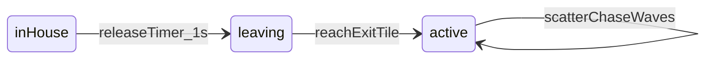

# Blinky (single enemy) v1

## Goal

Ship one Blinky: spawn in a carved ghost house, release ~1s after the player first moves, animate out the door, then run arcade-style **scatter/chase** waves (Blinky scatter corner + player-tile chase) with dossier intersection steering (simplified decide-at-center). Include **Cruise Elroy** (dot-threshold speed + chase-during-scatter). Tunnel slowdown. Circle overlap ends the run → menu. No frightened mode or other ghosts.

## Locked decisions

| ID  | Decision                                                                                                               | Source         |
| --- | ---------------------------------------------------------------------------------------------------------------------- | -------------- |
| 1   | **Scatter + chase** waves (level-1 schedule). No frightened.                                                           | user (revised) |
| 2   | Circle overlap → end run → `scene.start("MenuScene")` (no score write).                                                | user           |
| 3   | **Carve** walkable house + door.                                                                                       | user           |
| 4   | **Animate** exit through the door.                                                                                     | user           |
| 5   | Base corridor speed = level-1 ghost/Pac ratio: `PLAYER_SPEED * 0.9375` (75/80). Tunnel = `PLAYER_SPEED * 0.5` (40/80). | user + dossier |
| 6   | Decide turns when ghost center is aligned on a cell (not one-tile look-ahead).                                         | user           |
| 7a  | Tunnel slowdown in scope.                                                                                              | user           |
| 7b  | **Scatter corner + Cruise Elroy in scope** (this revision).                                                            | user           |
| 7c  | No red-zone up bans. **Do** force reverse on scatter↔chase (not fright).                                               | revised        |
| 8   | Collision = circle overlap.                                                                                            | user           |
| A   | Blinky only.                                                                                                           | prior          |
| B   | Chase target = player tile. Scatter target = Blinky corner (below). Elroy overrides scatter target → player tile.      | revised        |
| C   | Release: 1000ms after first non-`none` player `Input`.                                                                 | prior          |
| D   | Path pick: no voluntary reverse; min squared Euclidean; ties up > left > down > right.                                 | prior          |
| E   | ECS + domain helpers; scene wires only; render `blinky.png`.                                                           | prior          |
| F   | No fright / energizers / eaten-eyes.                                                                                   | user           |
| G   | **Cruise Elroy level-1 thresholds/speeds** (below). No Clyde-gate (no lives/Clyde).                                    | user + dossier |
| H   | Player cannot enter house/door.                                                                                        | prior          |
| I   | Docs: `ARCHITECTURE.md` + README Status.                                                                               | prior          |
| J   | Tests: path, house, release, mode schedule + reverse, Elroy target/speed, tunnel, catch.                               | revised        |
| K   | `npm run verify` + live visual on **5174**.                                                                            | prior          |
| L   | Final: `/no-comments` on scoped diff.                                                                                  | prior          |
| M   | Out of scope below.                                                                                                    | prior          |

### Scatter / chase schedule (level 1 only)

Single board = dossier **level 1** table (seconds). Clock starts when Blinky reaches the **exit tile** (`leaving` → active), in the **first scatter** wave:

1. Scatter 7s
2. Chase 20s
3. Scatter 7s
4. Chase 20s
5. Scatter 5s
6. Chase 20s
7. Scatter 5s
8. Chase indefinite

On every scatter↔chase boundary: set a one-shot **force reverse** on Blinky (reverse current facing/intent). No fright pause of this timer.

### Blinky scatter target

Fixed unreachable tile upper-right of our 28×31 maze: **`BLINKY_SCATTER_COL = 25`, `BLINKY_SCATTER_ROW = -3`**. Same pathfinder as chase; unreachable target → loops NE corner.

### Cruise Elroy (level 1)

Use `pelletProgress.pelletsRemaining` (no multi-level table):

| Tier   | When                    | Corridor speed                    | Scatter targeting                 |
| ------ | ----------------------- | --------------------------------- | --------------------------------- |
| none   | remaining > 20          | `PLAYER_SPEED * 0.9375` (75%)     | scatter corner                    |
| Elroy1 | remaining ≤ 20 and > 10 | `PLAYER_SPEED * 1.0` (80%)        | **player tile** (even in scatter) |
| Elroy2 | remaining ≤ 10          | `PLAYER_SPEED * (85/80) = 1.0625` | **player tile** (even in scatter) |

Tunnel always wins while in a tunnel-slow cell: `PLAYER_SPEED * 0.5` (ignore Elroy boost in tunnel). Mode-change reverses still fire during Elroy scatter periods.

## Today’s world (brief)

- No ghost gameplay; `public/art/ghosts/blinky.png` unused.
- Pipeline: `playerInput → movement → tickRunClock → collectPellets → render` in [`PlayScene.ts`](src/game/scenes/PlayScene.ts).
- [`movement.ts`](src/game/systems/movement.ts): global `PLAYER_SPEED`; `[Position, Velocity, Input, Facing]`.
- House `-` cells are solid; [`pelletProgress.ts`](src/domain/pelletProgress.ts) already exposes `pelletsRemaining`.

## Approach



### 1. Maze: carve house + dual solids

In [`src/domain/maze.ts`](src/domain/maze.ts):

- Carve door (row 12, cols 13–14) + interior floors; `#` walls stay; drop solid `-` house treatment.
- Grids: `MAZE_WALLS`, `MAZE_EXTERIOR`, `MAZE_HOUSE`, `MAZE_PLAYER_SOLIDS` (= walls ∪ exterior ∪ house), `MAZE_GHOST_SOLIDS` (= walls ∪ exterior).
- Constants: `GHOST_HOUSE_SPAWN_COL/ROW`, `GHOST_HOUSE_EXIT_COL/ROW` (corridor tile above door).
- Player movement/pellets use player solids; ghost steering uses ghost solids.
- Update [`maze.test.ts`](src/domain/maze.test.ts).

### 2. Speed component + tunnel + Elroy speeds

- [`Speed`](src/game/components/Speed.ts) SoA; player spawn `PLAYER_SPEED`.
- Domain [`src/domain/ghostSpeed.ts`](src/domain/ghostSpeed.ts): constants above + `resolveGhostSpeed({ pelletsRemaining, inTunnel })` → px/s.
- Movement reads per-eid `Speed`; shared integrate with per-eid solids.
- Each frame for active Blinky: `Speed = resolveGhostSpeed(...)`.

### 3. Release + mode machine

Components:

- `Ghost` tag.
- House phase: `inHouse | leaving | active` (number enum).
- Separate **global** mode clock in domain (not per-component fright): owned by PlayScene like `runClock`.

Domain:

- [`ghostRelease.ts`](src/domain/ghostRelease.ts): start on first player direction input; at 1000ms `inHouse` → `leaving`.
- Leaving: target = exit tile; on aligned arrival → `active`, **start mode schedule at scatter wave 0**.
- [`ghostMode.ts`](src/domain/ghostMode.ts): wave table (level-1 durations); `tickGhostMode(state, deltaMs)` → `{ mode: scatter|chase, forceReverse: boolean }`.
- On `forceReverse`: reverse Blinky’s `Facing` and `Input.direction` once.

### 4. Targeting + steering

[`ghostTarget.ts`](src/domain/ghostTarget.ts):

```text
if leaving → exit tile
else if mode === chase OR elroyTier !== none → player tile
else → BLINKY_SCATTER col/row
```

[`ghostPath.ts`](src/domain/ghostPath.ts): `pickGhostDirection` as before.

[`ghostAi.ts`](src/game/systems/ghostAi.ts): skip `inHouse`; on align, set `Input` from pick toward current target.

### 5. Pipeline

```text
playerInput
→ ghostRelease
→ tickGhostMode (after Blinky active; may force reverse)
→ ghostAi
→ applyGhostSpeed (Elroy + tunnel)
→ movement
→ tickRunClock
→ collectPellets → applyPelletCollect
→ catchPlayer
→ persist clear if any
→ render
→ if caught: MenuScene
```

### 6. Catch

Lethal once `leaving` or `active`. Circle overlap → menu; no high-score write.

### 7. Render + docs

- Preload/draw `blinky.png`; allow `GHOST_DRAWABLE_ID` in render filter.
- Architecture + README: scatter/chase, Elroy, tunnel, catch→menu.

## Data / contracts

| Name         | Shape                                                                 |
| ------------ | --------------------------------------------------------------------- |
| House phase  | `inHouse \| leaving \| active`                                        |
| Mode         | `scatter \| chase` + wave index + `elapsedMs` + `done`                |
| Elroy        | derived from `pelletsRemaining` vs 20 / 10                            |
| Speeds       | base 0.9375×, Elroy1 1.0×, Elroy2 1.0625×, tunnel 0.5× `PLAYER_SPEED` |
| Scatter tile | `(25, -3)`                                                            |
| Release      | 1000ms after first direction input                                    |

## Failure behavior

- No input → Blinky stays in house; mode clock not started.
- Missing blinky art → preload fails loud.
- Catch → menu, no score.
- Mode timer does not pause (no fright).
- House carve must keep flood/tunnels/tests green.

## Docs

- [`docs/ARCHITECTURE.md`](docs/ARCHITECTURE.md): pipeline, dual solids, mode/Elroy.
- [`README.md`](README.md) Status: Blinky scatter/chase + Elroy; no fright/other ghosts.

## Acceptance tests

1. `pickGhostDirection` distance + tie-break + no voluntary reverse.
2. Player blocked from house; ghost can use house/door; exit walkable.
3. Release 1s after input; leaving → active at exit; mode starts in scatter.
4. Mode schedule durations; each wave boundary sets force reverse once.
5. Scatter target `(25,-3)` when not Elroy; player tile in chase and when Elroy in scatter.
6. Speeds: base / Elroy1 at ≤20 / Elroy2 at ≤10 / tunnel overrides.
7. Catch → menu flag/transition; no score on catch.
8. `npm run verify` + live 5174: house → release → NE corner during first scatter → chase → Elroy late → touch → Menu.
9. `/no-comments` on scoped diff.

## Out of scope

- Pinky / Inky / Clyde
- Frightened mode, energizers, eating ghosts, eyes return
- Red-zone upward turn bans
- Lives / respawn / Clyde-gated Elroy suspend
- Levels 2+ schedule and Elroy tables
- Faithful one-tile look-ahead
- Pink door art / directional ghost eyes
- Audio

## Implementation order

1. Carve maze + dual solids + tests.
2. `Speed` + movement per-eid speed/solids.
3. `ghostPath` + `ghostTarget` + tests (scatter / chase / Elroy).
4. Release + mode schedule + force reverse + spawn Blinky.
5. `resolveGhostSpeed` (tunnel + Elroy) + catch → menu.
6. Render Blinky.
7. Docs + README.
8. `npm run verify` + live visual 5174.
9. `/no-comments`; fix findings; re-verify if needed.
